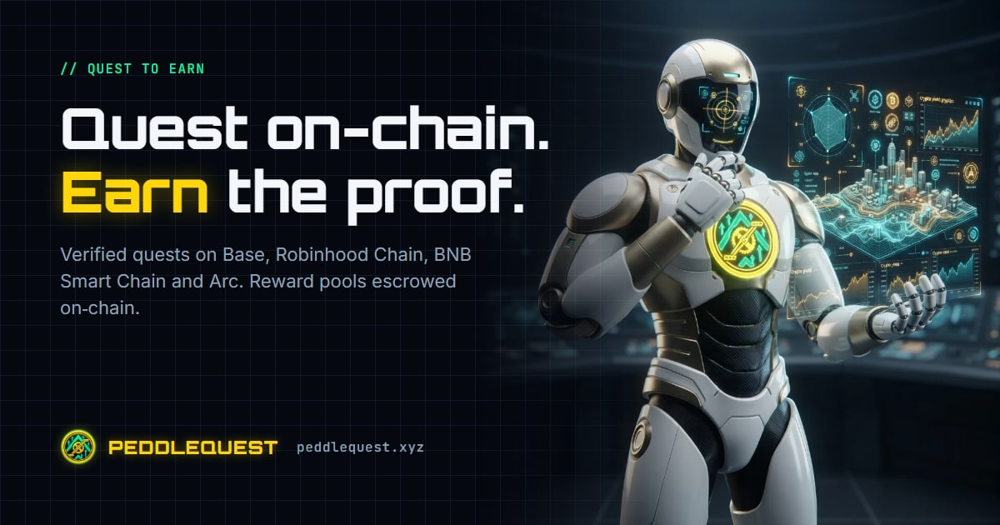

<p align="center">
  <a href="https://peddlequest.xyz">
    
  </a>
</p>

<h1 align="center">@peddlequest/sdk</h1>

<p align="center">
  The TypeScript SDK for <a href="https://peddlequest.xyz">PeddleQuest</a>: quests whose reward pools are escrowed on chain,
  on Base, Robinhood Chain, BNB Smart Chain and Arc.
</p>

<p align="center">
  <a href="https://peddlequest.xyz"></a>
  <a href="https://docs.peddlequest.xyz/integrations/sdk"></a>
  <a href="https://docs.peddlequest.xyz/integrations/build"></a>
  <a href="./PROMPT.md"></a>
  <a href="./LICENSE"></a>
</p>

---

## What you can build with it

| | |
|---|---|
| 📋 **Quest data** | List and read quests, tasks, scoreboards and reward assets from the public API, fully typed. No API key. |
| 🔒 **Escrow reads** | Read any quest's pool straight from the chain: funded, claimed, remaining, claim deadline, Merkle root. |
| 🎁 **Claims** | Build the claim transaction for a winner from the proof the API serves them. Their wallet sends it. |
| 🧾 **Winner verification** | Recompute a published winner list and compare it with the root on chain, in your own code or CI. |
| 🧩 **Widgets** | Quest card, leaderboard and live-quests list with auto-height: one function call, or one script tag with no build step. |
| 📈 **Promotion reads** | See which quests hold a Trending or Banner slot, and until when. |
| 🔗 **Referrals** | Pass your `ref` code through widgets and links so your visitors are attributed to you. |

## Integrate with Claude

[`PROMPT.md`](./PROMPT.md) is a ready-to-paste prompt. Give it to Claude inside
your project and say what you want ("show our live quests", "add a claim
button"). It lists what the SDK exports and the rules that matter, so Claude
does not invent endpoints or mishandle amounts.

## Links

- App: [peddlequest.xyz](https://peddlequest.xyz) · Create a quest: [peddlequest.xyz/creator](https://peddlequest.xyz/creator)
- Docs: [SDK](https://docs.peddlequest.xyz/integrations/sdk) · [Build on PeddleQuest](https://docs.peddlequest.xyz/integrations/build) · [Widgets](https://docs.peddlequest.xyz/integrations/embed) · [Contracts](https://docs.peddlequest.xyz/integrations/contracts) · [Webhook tasks](https://docs.peddlequest.xyz/integrations/webhook-tasks)
- Contracts, read live from each chain: [peddlequest.xyz/contracts](https://peddlequest.xyz/contracts)
- Blog: [blog.peddlequest.xyz](https://blog.peddlequest.xyz) · X: [@Ox_Forged](https://x.com/Ox_Forged) · Telegram: [@PeddleQuestBot](https://t.me/PeddleQuestBot) · GitHub: [peddlequest](https://github.com/peddlequest)
- Built by Gully Labs LLC · [team@gullylabs.xyz](mailto:team@gullylabs.xyz)

## At a glance

- ESM and CommonJS, with type declarations. Node 18+ and modern browsers.
- `viem` v2 is a **peer dependency**; there are no other runtime dependencies.
- Read-only by design: nothing in this package holds a key, signs or
  broadcasts. `buildClaimCall` returns a call object; your wallet sends it.

> **The PeddleQuest contracts are unaudited.** `PeddlesQuestEscrow` holds
> third-party funds. An external audit has not been completed. Each pool is
> limited by a per-quest deposit cap set at deploy, which bounds how much any
> one bug can affect.

## Install

> **Not on npm yet.** Until it is published, install it straight from this
> repository (it builds itself on install):

```bash
npm install github:peddlequest/quest-sdk viem
```

Once it is on npm:

```bash
npm install @peddlequest/sdk viem
```

## Public API: `createPeddleQuestClient`

```ts
import { createPeddleQuestClient } from '@peddlequest/sdk';

const pq = createPeddleQuestClient(); // apiUrl defaults to https://api.peddlequest.xyz/api

const { loyaltyProjects } = await pq.listQuests({ status: ['active'], chainIds: ['0x2105'] });
const quest = await pq.getQuest('base-launch-run-quest');
const tasks = await pq.getQuestTasks('base-launch-run-quest');
const board = await pq.getScoreboard('base-launch-run-quest', { page: 1, pageSize: 25 });
const pools = await pq.getQuestEscrow('base-launch-run-quest'); // base-unit amounts + winner snapshot link
const promos = await pq.getActivePromotions();
const assets = await pq.getRewardAssets();
```

| Method | Route |
|---|---|
| `listQuests(params)` | `GET /loyalty-projects` (`campaign`, `reward`, `status`, `partner`, `visible`, `featured`, `trending`, `paginate`, `full`, `page`, `search`, `suggested`, `current`, `chainIds`) |
| `getQuest(linkTitle)` | `GET /loyalty-project/:link` |
| `getQuestTasks(linkTitle)` | the quest's `loyaltyTasks`, sorted |
| `getScoreboard(linkTitle, { page, pageSize })` | `GET /loyalty-project/:link/scoreboard` |
| `getQuestEscrow(linkTitle)` | `GET /loyalty-project/:link/escrow` |
| `getActivePromotions()` | `GET /promotion/active` |
| `getRewardAssets()` | `GET /escrow/reward-assets` |
| `getClaimProofs(linkTitle, { token })` | `GET /loyalty-project/:link/claim/proof`. Needs the winner's own session token |

A non-2xx answer throws `PeddleQuestApiError` with `status`, `errorCode` and,
for a missing proof, a `reason` (`not_a_winner`, `not_finalised`,
`wallet_mismatch`, `no_wallet`, `not_escrow_routed`). Pass `fetch` to use your
own HTTP client.

**Amounts.** On-chain amounts (`grossAmount`, `fundedAmount`, proof `amount`)
are base-unit decimal strings and come with their `decimals`. The SDK never
assumes 18. The `rewards.tokens[].amount` figures on quest cards are human-unit
display numbers as the API sends them. Do not do arithmetic with them.

**Scoreboard privacy.** A scoreboard row's `wallet` field holds a **username**,
not an address. Leaderboards never publish wallets.

## Contracts

```ts
import { PEDDLEQUEST_CHAINS, getContracts, peddlesQuestEscrowAbi } from '@peddlequest/sdk';

getContracts(8453).escrow; // 0x16267bE6D067b3d411bf779B5aD041f9eba4CadE
```

| Chain | id | Escrow | Fee router | Promotion market | Badge |
|---|---|---|---|---|---|
| Base, Robinhood Chain, BNB Smart Chain, Arc | 8453, 4663, 56, 5042 | `0x16267bE6D067b3d411bf779B5aD041f9eba4CadE` | `0x0c90BD0A17879C9b627705206522020078C51231` | `0x704E5eA6752EbfcEDB377512b67c0138461f4849` | `0x6DA219d4072A91665F702e34ca6CcaCd3eA7AE91` |
| Sepolia (testnet) | 11155111 | `0xB55844D1ED3FACba7310137cA5F9d2ed70B1d462` | `0x06f0464D685A22503CcbBA7126eB91943c4c5b09` | `0x34E9876b90AD59615F7eDB52f3d122260d8aD623` | `0x7B3C605AA935E96e2319A54bBBC285B8331b39b0` |

The ABIs (`peddlesQuestEscrowAbi`, `peddlesPromotionMarketAbi`,
`peddlesQuestBadgeAbi`, `peddlesFeeRouterAbi`) are generated from the Foundry
artifacts. They include the reads, the public user actions, their events and
every custom error. Owner-only setters are left out.

### Escrow helpers

```ts
import { createPublicClient, http } from 'viem';
import { base } from 'viem/chains';
import { deriveEscrowQuestId, getQuestPool, buildClaimCall } from '@peddlequest/sdk';

const client = createPublicClient({ chain: base, transport: http() });

// keccak256(abi.encode(uint256 loyaltyProjectId, uint256 contractId))
const questId = deriveEscrowQuestId(1, 3);
const pool = await getQuestPool(client, 8453, questId);
// { funded, claimed, remaining, claimDeadline, merkleRoot, finalised, swept, exists, ... } bigints

// A winner claims with the proof the API serves them:
const [proof] = await pq.getClaimProofs('base-launch-run-quest', { token: sessionToken });
const call = buildClaimCall(proof); // { address, abi, functionName: 'claim', args, chainId }
await walletClient.writeContract({ ...call, account });
```

`buildClaimCall` refuses a proof that names any contract other than the
PeddleQuest escrow on that chain. Anyone can submit a claim, but the reward
always goes to `proof.account`. Call `hasClaimed(client, chainId, questId,
account)` to check the claim status on chain.

### Promotion slots

```ts
import { getPromotionSlot, PromotionPlacement, derivePromotionSubject } from '@peddlequest/sdk';

const slot = await getPromotionSlot(client, 8453, { loyaltyProjectId: 1 }, PromotionPlacement.Trending);
// { subject, buyer, startsAt, endsAt, paid, active }
```

The subject is `keccak256(abi.encode(string "peddlesquest.promotion.quest", uint256 loyaltyProjectId))`.

## Verifying a winner list

When a pool is finalised, the platform pins a winner snapshot to IPFS.
`getQuestEscrow()` returns it as `winnerSnapshotUrl` / `winnerSnapshotCid`, or
`null` if none was published. `verifyWinners` recomputes every leaf and the
Merkle root exactly as `PeddlesQuestEscrow.claim()` does. It checks the
arithmetic, then compares the result with `questOf(questId)` on chain:

```ts
import { verifyWinners } from '@peddlequest/sdk';

const result = await verifyWinners(pool.winnerSnapshotCid!, client); // or a URL, JSON text, or the object
result.match;    // true only if every check passed
result.failures; // every failed check, readable
result.notes;    // e.g. "content hash matches CID bafkrei..."
```

For a single-block raw CID (`bafkrei...`), the fetched bytes are hashed and
must match the CID, so a gateway cannot swap in a different file. Pass
`{ root }` with `null` as the client to run the check offline.

Leaf: `keccak256(bytes.concat(keccak256(abi.encode(address account, uint256 amount))))`.
Node: `keccak256(abi.encode(min(a, b), max(a, b)))`, compared as uint256. The
leaves are sorted ascending, and the last node of an odd level is promoted
unchanged.

**What a match proves.** The root on chain pays exactly the wallets and amounts
in the file. Those amounts add up to no more than the pool. For a scoreboard
quest, each place received exactly the reward tiers that cover it.

**What it does not prove.** It does not prove the points themselves. Task
verification happens off chain, and some task types are self-attested (see
below).

## Widgets

Three read-only widgets, each an iframe of the app. None of them knows who is
looking, so none shows progress. Every link opens in the **top window**.

```ts
import { mountQuestWidget, mountLeaderboardWidget, mountLiveQuestsWidget } from '@peddlequest/sdk';

// The quest card, with a "Join quest" button.
const quest = mountQuestWidget('#quest', { linkTitle: 'base-launch-run-quest', theme: 'dark', ref: 'your-code' });

// The quest's top places (1-25, default 10).
mountLeaderboardWidget('#board', { linkTitle: 'base-launch-run-quest', limit: 10 });

// A project's live quests, or a chain's (base, bsc, arc, robinhood, or an id). Mainnets only.
mountLiveQuestsWidget('#live', { project: 'your-project-slug', limit: 5 });
mountLiveQuestsWidget('#live-base', { chain: 'base', theme: 'light' });

quest.setHeight(600); // fixed height from now on
quest.destroy();      // removes the frame and its listener
```

| Widget | URL | Options |
|---|---|---|
| Quest | `/iframe/<linkTitle>` | `theme`, `ref` |
| Leaderboard | `/widget/leaderboard/<linkTitle>` | `theme`, `limit` (1-25), `ref` |
| Live quests | `/widget/quests?project=<slug>` or `?chain=<chain>` | `theme`, `limit` (1-20), `ref` |

Every mount function also takes `height` (the initial height), `autoHeight`
(default `true`), `maxWidth`, `title` and `appUrl`. `questWidgetUrl`,
`leaderboardWidgetUrl` and `liveQuestsWidgetUrl` return the URLs for
server-rendered HTML.

- **Auto-height.** The widget posts
  `{ type: 'peddlequest:resize', height, widget, id }` to the parent whenever
  its content changes height. The SDK accepts a message only from that frame's
  own window and from the app's origin, and then resizes the frame. Pass
  `autoHeight: false` to keep a fixed height. Calling `setHeight` also stops
  auto-height. The message carries only a height, the widget kind and the id
  from the URL, never viewer data.
- **`ref`.** Passed through untouched to the quest links (`/quest/<link>?ref=...`)
  for referral attribution. No `utm_*` parameters are added.
- **Theme.** `dark` (default) or `light`, sent to the widget as `?theme=`.
- **Honest states.** An unknown quest shows "not found". A failed request
  shows an error with "Try again". An empty board or list says so. A pool or
  an end date the API does not state is left out, never shown as `0`.
- **Leaderboard names.** Usernames only. An address-like name is shortened,
  an account without a username is "Unnamed player", and a name containing
  `@` is hidden.

### No-JavaScript-build loader

`https://peddlequest.xyz/widget.js` mounts any element with a
`data-peddlequest-*` attribute. The element can be the script tag itself.
It has no dependencies, and it handles auto-height the same way:

```html
<script src="https://peddlequest.xyz/widget.js" data-peddlequest-quest="base-launch-run-quest" async></script>

<div data-peddlequest-leaderboard="base-launch-run-quest" data-peddlequest-limit="10"></div>
<div data-peddlequest-live-quests data-peddlequest-project="your-project-slug"></div>
<div data-peddlequest-live-quests data-peddlequest-chain="base" data-peddlequest-theme="light"></div>
<script src="https://peddlequest.xyz/widget.js" async></script>
```

Options are `data-peddlequest-theme`, `-limit`, `-ref`, `-height`,
`-max-width`, `-title` and `-auto-height="false"`. Including the script
twice is harmless. Call `window.PeddleQuestWidgets.mount()` after adding
elements to the page.

> **Framing (2026-10-04).** From the release that ships these widgets, the app
> sends `Content-Security-Policy: frame-ancestors *` on `/iframe/*` and
> `/widget/*`. Browsers ignore `X-Frame-Options` when that header is present,
> which overrides the `X-Frame-Options: SAMEORIGIN` the edge proxy has been
> adding. Until that release is deployed, browsers block the frames on other
> sites.

## Honesty notes

- **Unaudited.** No audit report exists yet for the contracts.
- **What is verified.** Escrow pools, claims and the winners root are on
  chain, and you can read them yourself with this package. On-chain task types
  are checked over RPC.
- **What is self-attested.** Some task types are recorded as the user reports
  them, such as visit-link tasks and following an X account, where X's follow
  graph is not readable on the platform's API tier. Each task's description
  says so. Points from these tasks rank participants, and the winner snapshot
  cannot prove them.
- **Winner selection is off chain.** The chain sees only the Merkle root. The
  snapshot and `verifyWinners` make that root checkable.

## Development

```bash
npm install
npm test          # vitest: quest ids vs the five production pools, Merkle vs the backend builder, API client vs recorded fixtures, widget mounting + auto-height + public/widget.js
npm run build     # dist/ (ESM + CJS + .d.ts)
npm run smoke     # live: lists production quests and reads a Base pool over a public RPC (reads only)
npm run abis      # regenerate src/abis.ts from the Foundry artifacts (monorepo only)
```

## License

MIT
